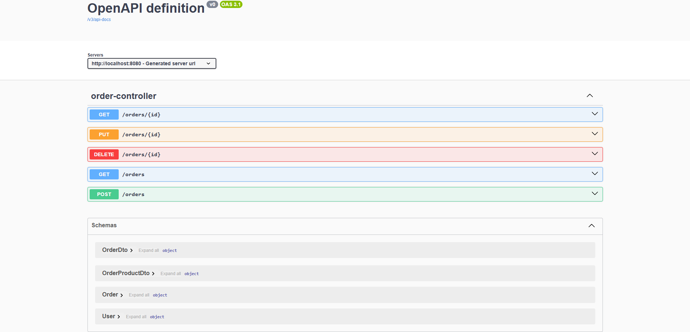

# Java Spring Simple Security

CRUD REST API to practice Spring Security basics.

## Technologies
- [JDK 17.0.9](https://www.oracle.com/java/technologies/javase/jdk17-archive-downloads.html)
- [Spring Boot](https://spring.io/projects/spring-boot)
- [Spring MVC](https://docs.spring.io/spring-framework/reference/web/webmvc.html)
- [Spring Data JPA](https://spring.io/projects/spring-data-jpa)
- [Spring Security](https://spring.io/projects/spring-security)
- [PostgreSQL](https://www.postgresql.org/download/)

## How to Run
- Clone this repository:
```
https://github.com/matheusbloize/java-spring-simple-security.git
```
- Create your PostgreSQL database
- Create .env and add environment variables ([example](https://github.com/matheusbloize/java-spring-simple-security/blob/main/.env.example))
- Build project:
```
./mvnw clean package
```
- Run app:
```
java -jar target/simple-security-food-order-system-0.0.1-SNAPSHOT.jar
```
- Run SQL Boilerplate to create a user
```
INSERT INTO tb_user VALUES (gen_random_uuid(), 'John Doe', '$2a$12$mjv.QSjzmq9lPX7yFu.XmeCnc/H8LF9RGSf/aD61pCm1sPPgIE1cS');

INSERT INTO tb_role VALUES (gen_random_uuid(), 'ROLE_USER');
INSERT INTO tb_role VALUES (gen_random_uuid(), 'ROLE_ADMIN');

INSERT INTO tb_users_roles (user_id, role_id)
SELECT u.id, r.id
FROM tb_user u
JOIN tb_role r ON r.name = 'ROLE_ADMIN'
WHERE u.name = 'John Doe';
```

### Links
Access with the user created:
- Name: John Doe
- Password: password  

API: 
- Orders: [localhost:8080/orders](http://localhost:8080/orders)

Swagger UI: [localhost:8080/swagger-ui/index.html](http://localhost:8080/swagger-ui/index.html)

## API Endpoints
```
GET    /orders          ADMIN only
POST   /orders          USER only
GET    /orders/{id}     ADMIN and USER (his orders)
PUT    /orders/{id}     ADMIN and USER (his orders)
DELETE /orders/{id}     ADMIN and USER (his orders)
```


